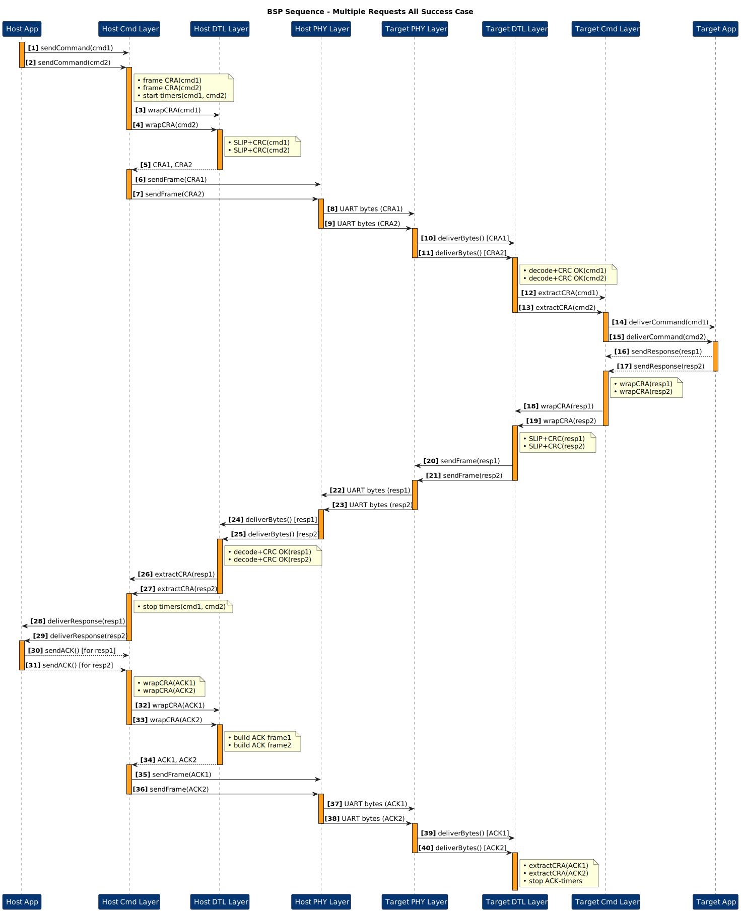

# General Serial Protocol (GSP)

## Document Info

- **Purpose**: A flexible, reliable, and extensible protocol for serial communication between a host (e.g., PC) and an embedded target over UART, supporting bootloader operations and customizable interactions.
- **Last Updated**: 2025-06-30
- **Version**: v0.1

---

## Contents

<strong>Table of Contents</strong>

- [General Serial Protocol (GSP)](#general-serial-protocol-gsp)
  - [Document Info](#document-info)
  - [Contents](#contents)
  - [1 Scope](#1-scope)
  - [2 Architecture](#2-architecture)
    - [2.1 Layered View](#21-layered-view)
    - [2.2 Command Frame (CRA Header)](#22-command-frame-cra-header)
      - [2.2.1 Field Explanations](#221-field-explanations)
      - [2.2.2 ACK-only Frame](#222-ack-only-frame)
        - [2.2.2.1 Bit-level layout](#2221-bit-level-layout)
        - [2.2.2.2 Field Explanations — ACK-only Frame](#2222-field-explanations--ack-only-frame)
    - [2.3 Response Frame (Bit-Field)](#23-response-frame-bit-field)
      - [2.3.1 Field Explanations](#231-field-explanations)
  - [3 Data Transfer Layer (DTL)](#3-data-transfer-layer-dtl)
    - [3.1 Frame layout](#31-frame-layout)
      - [Payload Breakdown](#payload-breakdown)
      - [3.1.1 Field Explanations](#311-field-explanations)
  - [4 Physical Layer](#4-physical-layer)
  - [5 Time-outs \& Retries](#5-time-outs--retries)
    - [5.1 Host Time-outs](#51-host-time-outs)
    - [5.2 Target Time-outs](#52-target-time-outs)
    - [5.3 Recommended Retry Limits](#53-recommended-retry-limits)
  - [6 Interaction Sequences](#6-interaction-sequences)
    - [6.1 Layered Sequence](#61-layered-sequence)
    - [6.2 Error \& Retry](#62-error--retry)
    - [6.3 Multiple Requests All Success Case](#63-multiple-requests-all-success-case)
    - [6.4 Multiple Requests Timeout Case](#64-multiple-requests-timeout-case)
    - [6.5 Single Command Duplicate ACK](#65-single-command-duplicate-ack)
    - [6.6 Single Command ACK Miss](#66-single-command-ack-miss)
    - [6.7 Single Corrupted Command](#67-single-corrupted-command)
    - [6.8 Single Command Corrupted Response](#68-single-command-corrupted-response)
    - [6.9 Bootloader Flow Example](#69-bootloader-flow-example)
      - [6.9.1 Erase Flash Sequence](#691-erase-flash-sequence)
      - [6.9.2 Write Chunk Sequence](#692-write-chunk-sequence)
      - [6.9.3 Verify Chunk Sequence](#693-verify-chunk-sequence)
      - [6.9.4 Reset and Run Sequence](#694-reset-and-run-sequence)
  - [7 Services](#7-services)
    - [7.1 Bootloader Services](#71-bootloader-services)
      - [7.1.1 Erase Flash](#711-erase-flash)
      - [7.1.2 Write Chunk](#712-write-chunk)
      - [7.1.3 Verify Chunk](#713-verify-chunk)
      - [7.1.4 Reset and Run](#714-reset-and-run)
      - [7.1.5 Abort](#715-abort)
    - [7.2 Extending the Protocol](#72-extending-the-protocol)
  - [8 Reference Tables](#8-reference-tables)
    - [8.1 Command IDs](#81-command-ids)
    - [8.2 Status Codes](#82-status-codes)
    - [8.3 CRC-16 Parameters](#83-crc-16-parameters)
    - [8.4 SLIP Special Bytes](#84-slip-special-bytes)
  - [9 Revision History](#9-revision-history)

---

## 1 Scope

The General Serial Protocol (GSP) enables robust, scriptable, and extensible communication between a host (e.g., a Python-based CLI on a PC) and an embedded target over a simple 3-wire UART (TX, RX, GND) with optional RTS/CTS flow control. While it supports bootloader operations such as erasing, programming, verifying, and running firmware on a remote MCU, GSP is designed as a general-purpose protocol. Users can define custom commands, payloads, and interaction sequences to suit diverse applications, such as debugging, configuration, or real-time data exchange.

Key features include:

- **Bootloader Support**: Facilitates firmware delivery and management (erase, program, verify, run, abort).
- **Extensibility**: Allows users to add custom commands and payloads for application-specific needs.
- **Reliability**: Incorporates CRC-16 error detection, ACK mechanisms, and retry logic.
- **Flexibility**: Supports pipelined transactions (up to 256 concurrent sessions) and prioritized command handling.

A single Command-Response-ACK (CRA) transaction follows:

---

## 2 Architecture

GSP uses a four-layer architecture to ensure modularity and flexibility:

- **Application Layer**: Manages high-level logic, such as bootloader state machines or custom application workflows.
- **Command Layer**: Handles Command-Response-ACK (CRA) framing, session management, and prioritization.
- **Data Transfer Layer**: Manages data fragmentation, CRC-16 error detection, and SLIP framing.
- **Physical Layer**: Defines UART parameters, flow control, and timing.

### 2.1 Layered View

- **Application Layer**: Custom application logic or bootloader state machine & CLI
- **Command Layer**: CRA framing, session IDs, priorities & ACK
- **Data Transfer Layer**: Fragmentation, CRC-16, SLIP
- **Physical Layer**: UART byte stream

### 2.2 Command Frame (CRA Header)

#### 2.2.1 Field Explanations

- **Unique ID (8 bits)**: A per-transaction handle generated by the host and echoed by the target, supporting up to 256 concurrent sessions.
- **Reserved (5 bits, bits 7…3 of Flags byte)**: Must be **0**. Reserved for future extensions; ignored by the target.
- **AF – Acknowledge Flag (1 bit, bit 2)**:

  | AF  | Meaning                                                      | Valid Priority bits |
  | :-: | ------------------------------------------------------------ | ------------------- |
  |  0  | **Command / Response** frame                                 | 0 – 3               |
  |  1  | **ACK-only** frame (no payload; `Command = 0x00`, `Len = 0`) | 0                   |

  _If **AF = 1**, the two priority bits **must** be `0`, and the frame length is fixed at 5 bytes._

- **Priority (2 bits, bits 1-0)**: Host-hinted urgency when **AF = 0**:

  | Value | Meaning  |
  | :---: | -------- |
  |   0   | Low      |
  |   1   | Normal   |
  |   2   | High     |
  |   3   | Critical |

- **Command (8 bits)**: Opcode chosen from [§8.1 · Command IDs](#81--command-ids) (e.g., `ERASE_FLASH 0x10`, or user-defined commands).
- **Payload (8 × n bits)**: Command-specific data. Length _n_ is specified in **Payload Len** (bytes 3-4). Total header + payload ≤ 64 bytes.

#### 2.2.2 ACK-only Frame

##### 2.2.2.1 Bit-level layout

|       **Byte**        | **Bit 7** | **Bit 6** | **Bit 5** | **Bit 4** | **Bit 3** | **Bit 2** | **Bit 1** | **Bit 0** | **Notes**                                                       |
| :-------------------: | :-------: | :-------: | :-------: | :-------: | :-------: | :-------: | :-------: | :-------: | --------------------------------------------------------------- |
| **0** (Session ID) |     —     |     —     |     —     |     —     |     —     |     —     |     —     |     —     | Echoes the request being acknowledged                           |
|   **1** (Flags)    |   **0**   |   **0**   |   **0**   |   **0**   |   **0**   |   **1**   |   **0**   |   **0**   | Reserved (5 bits)=0; AF (bit 2)=1 → ACK; Priority (bits 1-0)=00 |
|  **2** (Command)   |   **0**   |   **0**   |   **0**   |   **0**   |   **0**   |   **0**   |   **0**   |   **0**   | Command Code = 0x00                                             |

##### 2.2.2.2 Field Explanations — ACK-only Frame

- **Session ID (8 bits)**: Echoes the Unique ID from the request being acknowledged.
- **Reserved (5 bits, bits 7…3 of Flags)**: Always **0**. Non-zero reserved bits result in _STATUS_BAD_FLAGS_.
- **AF – Acknowledge Flag (1 bit, bit 2)**: Set to `1` for ACK-only frames (no payload). Priority must be `00`.
- **Priority (2 bits, bits 1-0)**: Must be **00** in an ACK.
- **Command (8 bits)**: Fixed to **0x00**.
- **No Payload**: ACK-only frames do not contain any payload. The **Payload** section is omitted as the frame is solely for acknowledgment.

---

### 2.3 Response Frame (Bit-Field)

| Byte(s) | Field          | Description                                                               |
| :-----: | :------------- | :------------------------------------------------------------------------ |
|    0    | **Session ID** | Echoes the Unique ID from the request, tying each response to its command |
|    1    | **Status**     | Outcome of the command; see [§8.2 Status Codes](#82-status-codes)         |
|   2–3   | **Resp Len**   | Payload length in bytes (little-endian)                                   |
|    …    | **Payload**    | Optional data (user-defined or command-specific)                          |

#### 2.3.1 Field Explanations

- **Session ID** (8 bits) – Identifies the session by echoing the command’s unique ID, ensuring the response matches the request.
- **Status** (8 bits) – Indicates success or error code for the command execution (OK, error, timeout, etc.).
- **Resp Len** (16 bits) – Byte count of the following payload, encoded little-endian.
- **Payload** (0–60 bytes) – Contains response-specific or user-defined data; optional based on command type.

---

## 3 Data Transfer Layer (DTL)

|  Field   | Size     | Description                                                     |
| :------: | :------- | :-------------------------------------------------------------- |
| SLIP END | 8 bits   | Start delimiter (0xC0) with 0xDB escaping                       |
| Payload  | Variable | Contains CRC EN, Reserved, Command Payload, and optional CRC 16 |
| SLIP END | 8 bits   | End delimiter (0xC0) with 0xDB escaping                         |

### 3.1 Frame layout

| SLIP END (Start) | Payload                                                      | SLIP END (End) |
| :--------------: | :----------------------------------------------------------- | :------------: |
|      8 bits      | 8 \* (n + 4) or 8 \* (n + 6) bits + k bits for SLIP encoding |     8 bits     |

#### Payload Breakdown

|      Field      | Size              | Description                                         |
| :-------------: | :---------------- | :-------------------------------------------------- |
|     CRC EN      | 1 bit             | Enables/disables CRC-16 (1 = enabled, 0 = disabled) |
|    Reserved     | 7 bits            | Reserved for future use, must be 0                  |
| Command Payload | 8 \* (n + 3) bits | Command-specific data, including header (n bytes)   |
|     CRC 16      | 16 bits           | Optional CCITT-False CRC over the payload           |

#### 3.1.1 Field Explanations

- **SLIP END (Start)** (8 bits) – Marks the beginning of the DTL frame using the 0xC0 byte, with 0xDB escaping applied to handle occurrences of 0xC0 or 0xDB within the payload.
- **Payload** (Variable) – Encapsulates the data content of the frame, including control flags and command data, with a size that varies based on the command length (n bytes) and SLIP encoding overhead (k bits). The total size is either 8 _ (n + 4) or 8 _ (n + 6) bits plus additional bits for SLIP encoding.
- **SLIP END (End)** (8 bits) – Marks the end of the DTL frame using the 0xC0 byte, ensuring proper frame delineation with 0xDB escaping for data integrity.
- **CRC EN** (1 bit) – A control bit that enables (1) or disables (0) the inclusion of the CRC-16 field, allowing flexibility in error checking based on application needs.
- **Reserved** (7 bits) – Reserved for future protocol extensions; must be set to 0 and ignored by the target to ensure compatibility with future updates.
- **Command Payload** (8 \* (n + 3) bits) – Contains the command-specific data, including a header of n bytes, where n is the length of the command data, providing up to 256 bytes of user-defined or flash-aligned data.
- **CRC 16** (16 bits) – An optional field that, when enabled by CRC EN, provides a CCITT-False CRC calculated over the payload to detect transmission errors, ensuring data integrity.

> **Note:** The next packet is sent **only** after an ACK (0x00) is confirmed. The CRC 16 field is included only if CRC EN is set to 1.

---

## 4 Physical Layer

| Parameter    | Value                           |
| :----------- | :------------------------------ |
| Baud Rate    | **115200 bps** (configurable)   |
| Word Format  | 8 data bits, no parity, 1 stop  |
| Flow Control | RTS/CTS (preferred) or XON/XOFF |
| Idle Timeout | 2 × max frame transmission time |

---

## 5 Time-outs & Retries

### 5.1 Host Time-outs

| Phase         | Timeout |
| :------------ | :------ |
| Wait for Resp | 200 ms  |
| Chunk Verify  | 300 ms  |

### 5.2 Target Time-outs

| Phase        | Timeout |
| :----------- | :------ |
| Wait for ACK | 200 ms  |

### 5.3 Recommended Retry Limits

- **Command → Response**: 5 retries
- **DTL chunk → ACK**: 5 retries
- **Verify → ACK**: 3 retries

---

## 6 Interaction Sequences

### 6.1 Layered Sequence

### 6.2 Error & Retry

### 6.3 Multiple Requests All Success Case

### 6.4 Multiple Requests Timeout Case

### 6.5 Single Command Duplicate ACK

### 6.6 Single Command ACK Miss

### 6.7 Single Corrupted Command

### 6.8 Single Command Corrupted Response

### 6.9 Bootloader Flow Example

The following sequences illustrate how GSP can be used for bootloader operations, such as erasing, programming, verifying, and running firmware. These are examples of GSP's capabilities, but users can define custom flows for other applications.

#### 6.9.1 Erase Flash Sequence

#### 6.9.2 Write Chunk Sequence

#### 6.9.3 Verify Chunk Sequence

#### 6.9.4 Reset and Run Sequence

---

## 7 Services

### 7.1 Bootloader Services

The following services demonstrate how GSP can be used for bootloader operations. These are predefined commands for firmware management, but users can extend GSP with custom commands for other purposes.

#### 7.1.1 Erase Flash

Erase flash memory (full or partial) on the target MCU.

**Command Message**

| Field         | Content              | Description                                                     |
| :------------ | :------------------- | :-------------------------------------------------------------- |
| AF            | `COMMAND_FRAME`      | Set frame as command frame (Flags.b3=0)                         |
| Command       | `ERASE_FLASH` (0x10) | Full or partial erase request                                   |
| Payload[0..3] | Start Address (LE)   | 32-bit little-endian flash address (omit for full-chip erase)   |
| Payload[4..7] | Length (LE)          | 32-bit little-endian length in bytes (omit for full-chip erase) |

**Response Message**

| Field   | Content     | Description                               |
| :------ | :---------- | :---------------------------------------- |
| Status  | Status byte | See [§8.2 Status Codes](#82-status-codes) |
| Payload | —           | None                                      |

#### 7.1.2 Write Chunk

Send a data fragment (0–256 bytes) to the target.

**Command Message**

| Field   | Content                  | Description                |
| :------ | :----------------------- | :------------------------- |
| AF      | `COMMAND_FRAME`          | Set frame as command frame |
| Command | `WRITE_CHUNK` (0x11)     | Write data chunk request   |
| Payload | Chunk data (0–256 bytes) | Raw data fragment          |

**Response Message**

| Field   | Content     | Description                               |
| :------ | :---------- | :---------------------------------------- |
| Status  | Status byte | See [§8.2 Status Codes](#82-status-codes) |
| Payload | —           | None                                      |

#### 7.1.3 Verify Chunk

Request CRC-check of the last written chunk.

**Command Message**

| Field   | Content               | Description                     |
| :------ | :-------------------- | :------------------------------ |
| AF      | `COMMAND_FRAME`       | Set frame as command frame      |
| Command | `VERIFY_CHUNK` (0x12) | Verify previously written chunk |
| Payload | —                     | None                            |

**Response Message**

| Field   | Content     | Description                               |
| :------ | :---------- | :---------------------------------------- |
| Status  | Status byte | See [§8.2 Status Codes](#82-status-codes) |
| Payload | —           | None                                      |

#### 7.1.4 Reset and Run

Exit the protocol and start the application.

**Command Message**

| Field   | Content                | Description                    |
| :------ | :--------------------- | :----------------------------- |
| AF      | `COMMAND_FRAME`        | Set frame as command frame     |
| Command | `RESET_AND_RUN` (0x13) | Exit protocol and run firmware |
| Payload | —                      | None                           |

**Response Message**

| Field   | Content     | Description                               |
| :------ | :---------- | :---------------------------------------- |
| Status  | Status byte | See [§8.2 Status Codes](#82-status-codes) |
| Payload | —           | None                                      |

#### 7.1.5 Abort

Cancel the current session.

**Command Message**

| Field   | Content         | Description                |
| :------ | :-------------- | :------------------------- |
| AF      | `COMMAND_FRAME` | Set frame as command frame |
| Command | `ABORT` (0x14)  | Cancel in-flight session   |
| Payload | —               | None                       |

**Response Message**

| Field   | Content     | Description                               |
| :------ | :---------- | :---------------------------------------- |
| Status  | Status byte | See [§8.2 Status Codes](#82-status-codes) |
| Payload | —           | None                                      |

### 7.2 Extending the Protocol

GSP is designed to be extensible. Users can:

- **Define Custom Commands**: Add new command IDs (beyond 0x14) with custom payloads and response formats.
- **Customize Interactions**: Create application-specific sequences, such as real-time data streaming or debugging workflows.
- **Modify Payloads**: Use the flexible payload field (up to 60 bytes) to encode application-specific data.
- **Integrate with CLI**: Extend the host CLI to support new commands and interaction flows.

To add a custom command:

1. Assign a unique Command ID (e.g., 0x15 for a debug command).
2. Define the payload structure and response format.
3. Update the target firmware and host CLI to handle the new command.
4. Document the command in the [§8.1 Command IDs](#81-command-ids) table.

---

## 8 Reference Tables

### 8.1 Command IDs

| Code | Mnemonic      | Direction | Comments              |
| :--: | :------------ | :-------: | :-------------------- |
| 0x10 | ERASE_FLASH   | Host→MCU  | Full or partial erase |
| 0x11 | WRITE_CHUNK   | Host→MCU  | Up to 256 bytes       |
| 0x12 | VERIFY_CHUNK  | Host→MCU  | CRC check             |
| 0x13 | RESET_AND_RUN | Host→MCU  | Jump to application   |
| 0x14 | ABORT         | Host→MCU  | Cancel session        |

### 8.2 Status Codes

| Value | Description   |
| :---- | :------------ |
| 0x00  | OK            |
| 0x01  | Generic error |
| 0x02  | Flash failure |
| 0x03  | Bad CRC       |
| 0x04  | Timeout       |

### 8.3 CRC-16 Parameters

- **Polynomial**: 0x1021
- **Initial Value**: 0xFFFF
- **Reflect In/Out**: No
- **XOR Out**: 0x0000

### 8.4 SLIP Special Bytes

| Name      | Value | Purpose                      |
| :-------- | :---- | :--------------------------- |
| `END`     | 0xC0  | Frame delimiter              |
| `ESC`     | 0xDB  | Escape indicator             |
| `ESC_END` | 0xDC  | Encodes literal 0xC0 in data |
| `ESC_ESC` | 0xDD  | Encodes literal 0xDB in data |

---

## 9 Revision History

| Date       | Version | Notes                |
| :--------- | :------ | :------------------- |
| 2025-06-30 | v0.1    | Initial public draft |
